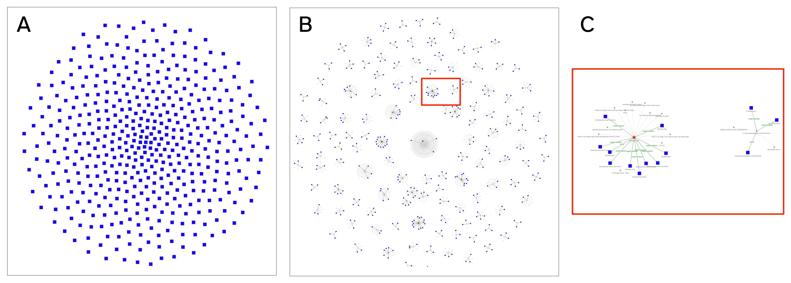

# Entity Resolved Knowledge Graphs

This hands-on tutorial in Python demonstrates integration of
[Senzing](https://github.com/Senzing) and [Neo4j](https://github.com/neo4j)
to construct an _Entity Resolved Knowledge Graph_:

  1. Use three datasets describing businesses in Las Vegas: ~100K records, 4% duplicates.
  2. Run _entity resolution_ in Senzing to resolve duplicate business names and addresses.
  3. Parse results to construct a _knowledge graph_ in Neo4j.
  4. Analyze and visualize the _entity resolved knowledge graph_.

We'll walk through example code based on Neo4j Desktop and the
[Graph Data Science](https://github.com/neo4j/graph-data-science-client)
(GDS) library to run Cypher queries on the graph,
preparing data for downstream analysis and visualizations with
[Jupyter](https://jupyter.org/),
[Pandas](https://pandas.pydata.org/),
[Seaborn](https://seaborn.pydata.org/),
[PyVis](https://pyvis.readthedocs.io/en/latest/).

The code is simple to download and easy to follow, and presented so
you can try it with your own data.



Why?
For one example, popular use of _retrieval augmented generation_ (RAG)
to make AI applications more robust has boosted recent interest in KGs.
When the entities, relations, and properties in a KG leverage your
domain-specific data to strengthen your AI app ... compliance issues
and audits rush to the foreground.

TL;DR: sense-making of the data coming from a connected world.
During the transition from data integration to KG construction,
you need to make sure the entities in your graph get resolved correctly.
Otherwise, your AI app downstream will struggle with the kinds of details
that make people get concerned, very concerned, very quickly:
e.g., billing, deliveries, voter registration, crucial medical details,
credit reporting, industrial safety, security, and so on.

Highly recommended:
  - ["Analytics on Entity Resolved Knowledge Graphs"](https://youtu.be/ZgK5YHNixTM), Mel Richey (2023)


## Prerequisites

In this tutorial we'll work in two environments.
The configuration and coding are at a level which should be comfortable
for most people working in data science.
You'll need to have familiarity with how to:

  - clone a public repo from GitHub
  - launch a server in the cloud
  - use Linux command lines
  - write some code in Python

Total estimated project time: 35 minutes.

Cloud computing budget: running Senzing in this tutorial cost a total
of $0.04 USD.


## Set up local environment

After cloning this repo, connect into the `ERKG` directory and set up
your local environment:

```bash
git clone https://github.com/DerwenAI/ERKG.git
cd ERKG

python3.11 -m venv venv
source venv/bin/activate

python3 -m pip install -U pip wheel setuptools
python3 -m pip install -r requirements.txt 
```

We're using Python 3.11 here, although this code should run with most
of the recent Python 3.x versions.


## Run the tutorial notebooks

First, launch Jupyter:

```bash
./venv/bin/jupyter lab
```

Then based on the [tutorial](TBD), follow the steps shown in these notebooks:

  1. [`examples/datasets.ipynb`](examples/datasets.ipynb)
  2. [`examples/graph.ipynb`](examples/graph.ipynb)
  3. [`examples/impact.ipynb`](examples/impact.ipynb)

You can view the results --
an interactive visualization of the entity resolved knowledge graph --
by loading [`examples/big_vegas.2.html`](examples/big_vegas.2.html)
in a web browser.
The full HTML+JavaScript is large and may take several minutes to load.


## Kudos

Many thanks to:
[@akollegger](https://github.com/akollegger),
[@brianmacy](https://github.com/brianmacy)
