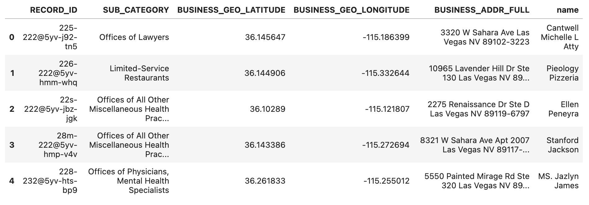
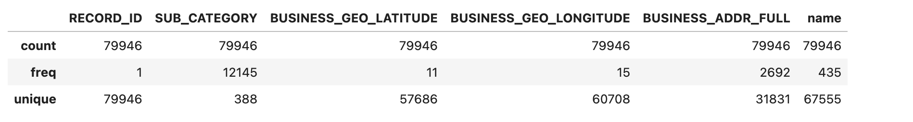
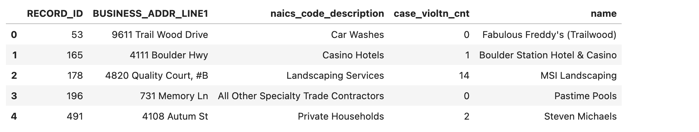
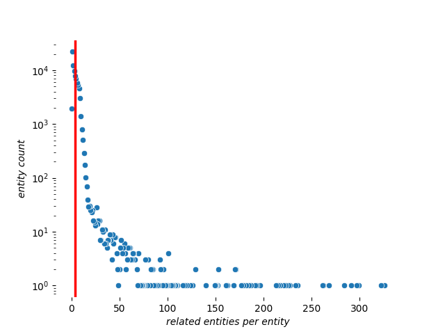
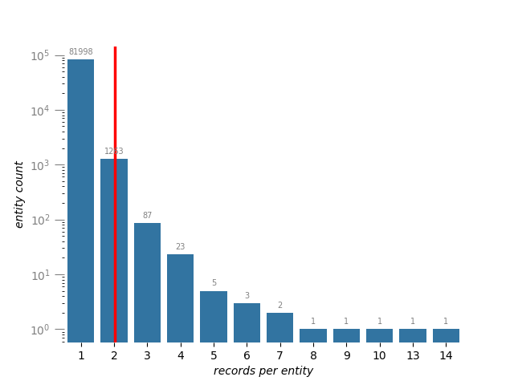
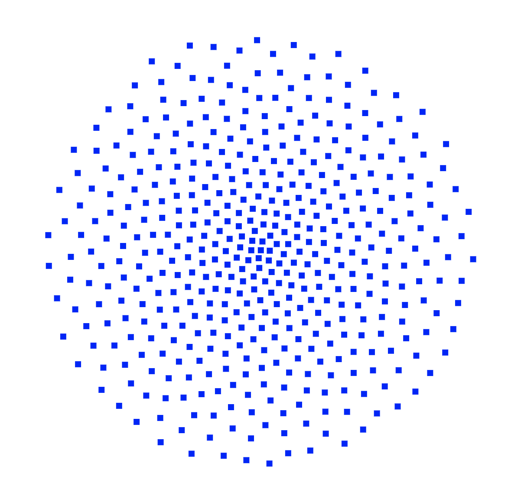
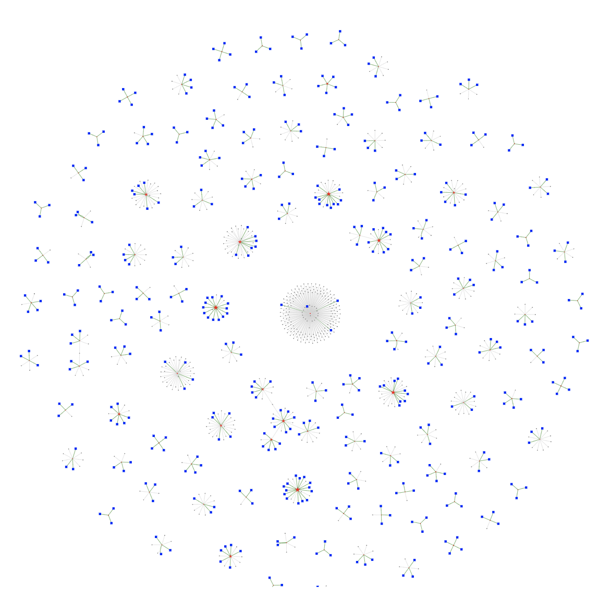
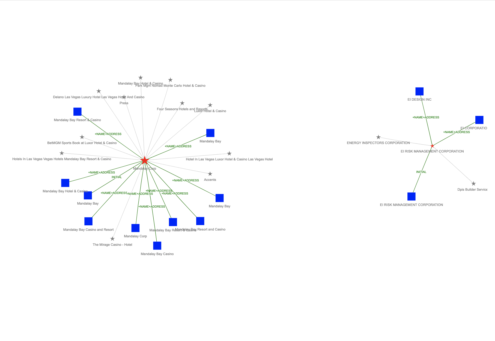

## Leverage entity resolution to construct knowledge graphs

## Introduction

This article provides a hands-on tutorial to get started running both [Senzing](https://senzing.com/) for _entity resolution_ and [Neo4j](https://neo4j.com/) for _knowledge graphs_, working in Python code.
We'll begin with three datasets, clean up entities in the data, and finally build a knowledge graph from the results.
The code shown here is intended to be simple to download, easy to follow, and presented so you can also try it with your own data.

In this tutorial we'll be working in two environments which require some hands-on configuration and coding.
The examples show code at level which should be fine for most anyone working in data science.
You need to have some familiarity with each of the following:

  - simple Python programming
  - using a Linux command line
  - cloning a public repo from GitHub

Although _knowledge graphs_ (KGs) have been around for many years, there's been lots of recent interest due to uses with AI. For example, it turns out that KGs are super helpful to "ground" the prompts and results of chatbots, to reduce "hallucination" errors in AI models.

We need to discuss about _entity resolution_ (ER), which becomes especially important when you're working with knowledge graphs.
Recognize that knowledge graphs help us understand _relations_ between _entities_.
You can think in terms of language grammar, where entities are the "nouns" and relations are the "verbs" connecting them.
In the sentence `"Jack catches the ball"` there are two entities `"Jack"` and `"the ball"` which are both nouns, and these are connected by a relation `"catches"` which is a verb.
This approach of using graphs allows for very flexible ways of representing knowledge in general.
Also, there are many powerful algorithms which can be applied for graph data, plus queries, graph machine learning, and so on.

But there are caveats.
If the quality of our input datasets is anything like _most_ data in the world, there will be errors.
Imagine that someone named `"Robert Smith"` lives on `"First Street"` in a large city, and there's also `"Robert A. Smith"` and `"Robert Smith, Jr."` or some typo introduced in official records, confusing either their names or addresses.
Either case makes record matching confusing and within public records "confusing" might get numbered in the tens, or hundreds, or thousands.
On the one hand, `"Robert X."` might not be amused to receive an electricity bill for `"Robert A."` when the post office mixes up records.
On the other hand, if `"Robert X."` recently fled from an arrest, `"Robert A."` is going to hope the police department doesn't make the same mistake.

When we build knowledge graphs we want to make sure that unique entities don't get fragmented into a bunch of other poorly connected entities.
Nor do we want different entities to get collapsed into one giant blob.
The process of ER involves highly sophisticated decisions about input data records, being careful to consolidate multiple references to the same entity together, while splitting references which are different.
In other words, when we scan a thousand records from different sources describing a community, then based on names and addresses we want to determine which records are shared by the same entity, and which records represent unique entities.

By the way, if you're already familiar with _natural language processing_ (NLP) tools used in data science, such as the popular [`spaCy` library](https://spacy.io/) in Python, you may have used [_named entity recognition_](https://nlpprogress.com/english/named_entity_recognition.html) (NER) previously.
Understand that NER is quite different from ER: NER simply identifies spans of text which are likely to be proper nouns (i.e., entities) then tags them with labels.
So is `"Jack"` a person, place, or thing?
Jack is a person.
The ball is a thing.
NER provides `"person"` and `"thing"` as labels.
That's helpful for _parsing_ text, but not especially useful for constructing KGs.
Your input data might contain references to different but overlapping entities, in which case after running NER you'll need to clean up the KG by _disambiguating_ entities **after** they've been linked.
That's generally quite a mess, and can be costly.

Use ER on your data records first, then build your graph.
This is a much better way to produce useful graph data and make the most of KGs, AI applications, and so on.


## Senzing and Neo4j background

Before we jump into code, let's cover some background about the two technologies we're showing in this tutorial: Senzing and Neo4j.

[Senzing](https://senzing.com/) provides a 6th generation industrial strength engine for _entity resolution_.
The product has been shipping since 2012 and is used around the world by law enforcement, tax authorities, defense/ intelligence agencies, and enterprise applications in general.
The company's expertise in this field is stellar: people on this team have on average more than 20 years experience in ER production, often in extreme cases.

Note that the code for Senzing is open source.
Check out <https://github.com/Senzing> on GitHub where you can find more than 30 public repos.
You can download and get running right away, with a free license for up to 100,000 records.
This scales from the largest use cases all the way down to running on a laptop.
You can run from Docker containers available as source on GitHub or images on [Docker Hub](https://hub.docker.com/u/senzing), or develop code using [API bindings](https://docs.senzing.com/) for Java and Python.

A motto at the company is "We see transmissions, not cars."
To be clear, everything about this technology is laser-focused on providing speed, accuracy, and throughput for the best quality ER available -- connecting the right data to the right person, in real time.
For details about the company, see the ["Senzing AI: A New Era"](https://senzing.com/senzing-ai-video/).
For deep-dives into how Senzing _entity resolution_ works, see these two technical overview articles:

  - ["Principle-Based Entity Resolution Explained"](https://senzing.com/principle-based-ER)
  - ["Entity Resolution Capabilities to Consider"](https://senzing.com/er-capabilities)

[Neo4j](https://neo4j.com/) is the world's most popular solution for graph databases.
It provides native graph storage, graph data science, graph machine learning, analytics, and visualization -- with enterprise-grade security controls to scale transactional and analytic workloads.

First released in 2010, Neo4j pioneered using [Cypher](https://en.wikipedia.org/wiki/Cypher_(query_language)), a declarative graph query language for _labeled property graphs_.
As mentioned, graphs help us understand **relationships**.
In contrast, relational databases, data warehouses, data lakes, data lakehouses, etc., tend to emphasize **facts**.
That's important because AI -- and for that matter, _business decisions_ in general -- depend on relationships within the data.

Extending from the "nouns" and "verbs" analogy we'd described above, Cypher also provides for _properties_.
You can think of these as the "adjectives" in human language.
The expressiveness of Cypher queries results in data analytics applications with 10x less code than comparable applications written in SQL.

Neo4j has an incredible developer community, with so many resources available online.
Check out  <https://github.com/neo4j> on GitHub for more than 70 public repos supporting a wide range of graph technologies.
For an excellent introduction overall, see the recent ["Intro to Neo4j"](https://www.youtube.com/watch?v=YDWkPFijKQ4&t=572s) video.
Also check the many courses, certifications programs, and other resources at [GraphAcademy](https://graphacademy.neo4j.com/).


## Get started with Neo4j

To get started coding, first let's set up a _Neo4j Desktop_ application, beginning with the download instructions at <https://neo4j.com/download/> for your desktop or laptop.
This is available on Mac, Linux, and Windows.
While there are multiple ways to get started with Neo4j, Desktop provides a quick way to begin working with the general set of features that we'll need.

Once the download completes, follow the [instructions to install the Desktop application](https://neo4j.com/docs/desktop-manual/current/installation/download-installation/) and register to obtain an activation key for it.
Then open the application and copy/paste your activation key.

Next, [create a new project and a database](https://neo4j.com/docs/desktop-manual/current/operations/create-dbms/) -- named `Senzing` in our example, located within the `Entity Resolution` project.
By default `neo4j` is the user name for accessing this database, then Neo4j Desktop requires setting a password -- `Z1ngs3n!` in our example.
You'll also need to select a version -- we'll use 5.17.0 which is recent at the time of this writing.


Click on the newly created database, then a right side panel will show settings and administrative links -- as shown in the "Neo4j Desktop" figure.
Click on the `Plugin` link, open the `Graph Data Science Library` drop-down, then [install this plugin](https://neo4j.com/docs/graph-data-science/current/installation/neo4j-desktop/).

Click on the `Start` button.
Your GDS plugin will be in place, and local service endpoints for accessing the graph database should be ready.
Now click on the `Details` link and find the port number for the [Bolt protocol](https://neo4j.com/docs/bolt/current/bolt/).
In our example `7687` is the Bolt port number.

Next, open a browser window to our GitHub public repo for this tutorial:

  - <https://github.com/Senzing/ERKG>

Clone the repo by copying its URL from GitHub, as shown in the "Clone public repo" figure.
Then use the following steps to create your **working directory** on your desktop/laptop for this tutorial:

```bash
git clone https://github.com/Senzing/ERKG.git
cd ERKG
```

After connecting into your working directory, create a file called `.env` which provides the credentials (Bolt URL, DBMS username, password) needed to access the database in Neo4j Desktop through Bolt:

```
NEO4J_BOLT=bolt://localhost:7687
NEO4J_DBMS=neo4j
NEO4J_USER=neo4j
NEO4J_PASS=Z1ngs3n!
```

Neo4j Desktop provides many useful tools, including a browser for exploring your graph database and running [Cypher queries](https://neo4j.com/docs/cypher-manual/current/introduction/), and the [Bloom data visualization tool](https://neo4j.com/product/bloom/).
You can also export and import "dumps" of your database on disk, to manage backups.

Neo4j is good to go!
For the rest of this tutorial, keep this Neo4j Desktop application running in the background.
We'll access it through the Graph Data Science (GDS) library using Python code.
To learn more about GDS, see its source repo and docs:

  - <https://github.com/neo4j/graph-data-science-client>
  - <https://neo4j.com/docs/graph-data-science/current/>


## The input datasets

We'll be working with three datasets to run entity resolution and build a knowledge graph.
To start, let's set up a Python environment and install the libraries we'll need.
Then we can run code examples inside [Jupyter](https://jupyter.org/) notebooks.
We show use of Python 3.11 here, although other recent versions of Python should work well too.

Set up a virtual environment for Python and load the required dependencies:

```bash
python3.11 -m venv venv
source venv/bin/activate
python3 -m pip install -U pip wheel setuptools
python3 -m pip install -r requirements.txt
```

This tutorial uses several popular libraries which are common in data science work:

```
ipywidgets >= 8.1
jupyterlab >= 4.1
jupyterlab_execute_time >= 3.1
matplotlib >= 3.8
graphdatascience[networkx] >= 1.9
python-dotenv >= 1.0
pyvis >= 0.3
seaborn >= 0.13
tqdm >= 4.66
watermark >= 2.4
```

Now launch Jupyter:

```bash
./venv/bin/jupyter lab
```

JupyterLab should automagically open in your browser.
Otherwise, open <http://localhost:8888/lab> in a new browser tab.
Then run the `datasets.ipynb` notebook.

First we need to import the Python library dependencies required for the code we'll be running:

```python
import json
import os
import pathlib
import sys
import typing

from graphdatascience import GraphDataScience
from tqdm import tqdm
import dotenv
import pandas as pd
import watermark

%load_ext watermark
```

The `graphdatascience` import loads the GDS library for Neo4j.
This works alongside the [`pandas`](https://pandas.pydata.org/) library for the heavy-lifting in our tutorial.

Let's double-check the [watermark](https://github.com/rasbt/watermark) trace, in case anyone needs to troubleshoot dependencies on their system:

```python
%watermark
%watermark --iversions
```

For example, the results should look like:

```
Last updated: 2024-03-26T15:51:15.530137-07:00

Python implementation: CPython
Python version       : 3.11.0
IPython version      : 8.22.2

Compiler    : Clang 13.0.0 (clang-1300.0.29.30)
OS          : Darwin
Release     : 21.6.0
Machine     : x86_64
Processor   : i386
CPU cores   : 8
Architecture: 64bit

json     : 2.0.9
watermark: 2.4.3
pandas   : 2.2.1
sys      : 3.11.0 (v3.11.0:deaf509e8f, Oct 24 2022, 14:43:23) [Clang 13.0.0 (clang-1300.0.29.30)]
```

Python, Jupyter, GDS, Pandas, and friends are good to go!
Let's leverage these to explore the datasets we'll be using.

In this tutorial, we'll use three datasets, each of which describe business info -- names, addresses, plus other details, depending on the dataset:

  - SafeGraph `Places of Interest` (POI)
  - US Dept of Labor `Wage and Hour Compliance Action Data` (WHISARD)
  - US Small Business Administration `PPP Loans over $150K` (PPP)

Two of these datasets are public, and one is available commercially.
You can obtain a full version of each dataset from the links given below.
In this tutorial we'll use versions of these datasets which have been constrained to businesses within the Las Vegas metropolitan area.
We've also included a `DATA_SOURCE` column to each dataset, so we can load and track records in Senzing later.

Note that we don't need to show all of the columns available for each dataset, but let's explore a few key ones.
To help do this, we'll define a utility function `sample_df()` to show a subset of the columns in a Pandas `DataFrame` object:

```python
def sample_df (
    df: pd.DataFrame,
    cols_keep: typing.Set[ typing.Any ],
    ) -> pd.DataFrame:
    """
Remove all but the specified columns from a copy of the given Pandas dataframe.
https://stackoverflow.com/a/51285940/1698443
    """
    diff: typing.Set[ typing.Any ] = set(df.columns) - cols_keep
    return df.drop(diff, axis = 1, inplace = False)
```

Now let's load the `Places of Interest` (POI) dataset for Las Vegas, which can be obtained from SafeGraph: <https://www.safegraph.com/products/places>

```python
poi_path: pathlib.Path = pathlib.Path("lv_data") / "poi.json"

df_poi: pd.DataFrame = pd.DataFrame.from_dict(
    [ json.loads(line) for line in poi_path.open(encoding = "utf-8") ],
)
```

Taking a look at the column names...

```python
df_poi.columns
```

...the `"DATA_SOURCE"`, `"RECORD_ID"`, `"RECORD_TYPE"` columns are needed by Senzing to identify unique records, then other columns related to names or addresses will also get used during ER:

```
Index(['DATA_SOURCE', 'RECORD_ID', 'RECORD_TYPE', 'PLACEKEY',
       'LOCATION_NAME_ORG', 'BRANDS', 'TOP_CATEGORY', 'SUB_CATEGORY',
       'NAICS_CODE', 'BUSINESS_GEO_LATITUDE', 'BUSINESS_GEO_LONGITUDE',
       'CATEGORY_TAGS', 'CLOSED_ON', 'TRACKING_CLOSED_SINCE', 'PHONE_NUMBER',
       'BUSINESS_ADDR_COUNTRY', 'BUSINESS_ADDR_FULL',
       'MAILING_VERIFIED_STATUS', 'OPENED_ON', 'IS_INTERSECTION'],
      dtype='object')
```

See the [SafeGraph docs](https://docs.safegraph.com/docs/places-base-attributes) for detailed descriptions of the data in each of these columns.

Let's check out a few key columns:

```python
df = sample_df(
    df_poi,
    set([
        "RECORD_ID",
        "LOCATION_NAME_ORG",
        "SUB_CATEGORY",
        "BUSINESS_GEO_LATITUDE",
        "BUSINESS_GEO_LONGITUDE",
        "BUSINESS_ADDR_FULL",
    ]),
)

df.head()
```



From this sample, note the unique values in `RECORD_ID` plus the business names and addresses.
The business category values could be used to add structure to the knowledge graph -- as a kind of _taxonomy_.
The latitude/longitude geo-coordinates can also help us convert the results of graph queries into map visualizations.

Let's analyze the data values in these columns:

```python
df.describe().loc[[ "count", "freq", "unique", ]]
```



Great, we've got nearly 98,806 records to work with, and their `RECORD_ID` values are all unique.
There are nearly 400 different kinds of business categories, which should be fun to visualize.

Quite interestingly, there are 84,643 unique values of `LOCATION_NAME_ORG` and 43,900 unique values of `BUSINESS_ADDR_FULL` -- which implies there is overlap among the business entities.
Clearly, we'll need to run _entity resolution_ to make use of this dataset!

Next, let's load the `Wage and Hour Compliance Action Data` (WHISARD) dataset for Las Vegas, from the US Department of Labor: <https://enforcedata.dol.gov/views/data_summary.php>

```python
dol_path: pathlib.Path = pathlib.Path("lv_data") / "dol.csv"
df_dol: pd.DataFrame = pd.read_csv(dol_path, dtype = str, encoding = "utf-8")
```

You'll need to click through links on the DoL web site to reach their _data dictionary_ which describes each of the fields.
It's not possible to link directly to this information.

Looking at the column names...

```python
df_dol.columns
```

...again we have `DATA_SOURCE`, `RECORD_ID`, plus business names and address info, followed by lots of DoL compliance data about hourly workers:

```
Index(['RECORD_TYPE', 'DATA_SOURCE', 'RECORD_ID', 'case_id',
       'BUSINESS_NAME_ORG', 'LEGAL_NAME_ORG', 'BUSINESS_ADDR_LINE1',
       'BUSINESS_ADDR_CITY', 'BUSINESS_ADDR_STATE',
       'BUSINESS_ADDR_POSTAL_CODE',
       ...
       'flsa_smwsl_bw_atp_amt', 'flsa_smwsl_ee_atp_cnt', 'eev_violtn_cnt',
       'h2b_violtn_cnt', 'h2b_bw_atp_amt', 'h2b_ee_atp_cnt', 'sraw_violtn_cnt',
       'sraw_bw_atp_amt', 'sraw_ee_atp_cnt', 'ld_dt'],
      dtype='object', length=113)
```

Let's check some of the more interesting columns:

```python
df = sample_df(
    df_dol,
    set([
        "RECORD_ID",
        "BUSINESS_NAME_ORG",
        "BUSINESS_ADDR_LINE1",
        "naics_code_description",
        "case_violtn_cnt",
    ]),
)

df.head()
```



Again we have unique record IDs, business names and addresses, then also some [NAICS](https://www.census.gov/naics/) business classification info -- which the POI dataset also includes.
The `case_violtn_cnt` column provides a count of compliance violation cases, and that might be interesting to use in graph queries later.

Analyzing data values in this sample:

```python
df.describe().loc[[ "count", "freq", "unique", ]]
```


Again, the record IDs are unique and there's overlap among business names and addresses.
However, we only have 1533 records here, so it's likely that not every resolved entity will link to DOL information.
But we'll make use of what we've got.

Next we'll load the `PPP Loans over $150K` (PPP) dataset for Las Vegas, from the US Small Business Administration: <https://data.sba.gov/dataset/ppp-foia>

```python
ppp_path: pathlib.Path = pathlib.Path("lv_data") / "ppp.csv"

df_ppp: pd.DataFrame = pd.read_csv(
    ppp_path,
    dtype = str,
    encoding = "utf-8",
)

df_ppp.columns
```

This dataset adds more details from US federal open data about each business, based on their PPP loans (if any) during the Covid-19 pandemic:

```
Index(['RECORD_TYPE', 'DATA_SOURCE', 'RECORD_ID', 'Loan_Range',
       'BUSINESS_NAME_ORG', 'BUSINESS_ADDR_LINE1', 'BUSINESS_ADDR_CITY',
       'BUSINESS_ADDR_STATE', 'BUSINESS_ADDR_POSTAL_CODE', 'NAICS_Code',
       'Business_Type', 'OwnedByRaceEthnicity', 'OwnedBy', 'OwnedByVeteran',
       'NonProfit', 'JobsReported', 'DateApproved', 'Lender', 'CD'],
      dtype='object')
```

Let's take a look at a sample:

```python
df = sample_df(
    df_ppp,
    set([
        "RECORD_ID",
        "BUSINESS_NAME_ORG",
        "BUSINESS_ADDR_LINE1",
        "Business_Type",
        "JobsReported",
    ]),
)

df.head()
```


Great, we get more info about business types, and we also get new details about employment.
Both of these could complement the DOL dataset.

Analyzing data values in this sample:

```python
df.describe().loc[[ "count", "freq", "unique", ]]
```


Again, the record IDs are unique and there's overlap among business names and addresses.
We have 3488 unique records, so not all resolved entities are likely to have PPP data.
There are 13 different business types, which could also help add structure to our knowledge graph.

Now that we have our three datasets ready, let's load their records into Neo4j.
First we need to use our credentials -- which were stored in the `.env` local file in our working directory -- to create a GDS connection to our `Senzing` graph database running in Neo4j Desktop:

```python
dotenv.load_dotenv(dotenv.find_dotenv())

bolt_uri: str = os.environ.get("NEO4J_BOLT")
database: str = os.environ.get("NEO4J_DBMS")
username: str = os.environ.get("NEO4J_USER")
password: str = os.environ.get("NEO4J_PASS")

gds:GraphDataScience = GraphDataScience(
    bolt_uri,
    auth = ( username, password, ),
    database = database,
    aura_ds = False,
)
```

Don't worry if you get a `"Failed to write data to connection..."` error.
It's spurious here.

To prepare to add structure to our graph, by adding [_constraints_](https://neo4j.com/docs/cypher-manual/current/constraints/) to ensure uniqueness of records and entities, where we expect uniqueness.

```python
gds.run_cypher("""
CREATE CONSTRAINT unique_record 
    IF NOT EXISTS FOR (rec:Record) 
    REQUIRE rec.uid IS UNIQUE
""")

gds.run_cypher("""
CREATE CONSTRAINT unique_entity 
    IF NOT EXISTS FOR (ent:Entity) 
    REQUIRE ent.uid IS UNIQUE
""")
```

Now let's define two utility methods to help clean the data from our datasets when loading records into Neo4j:

```python
def get_property_keys (
    df: pd.DataFrame,
    ) -> typing.List[ str ]:
    """
Convert the column names from the given Pandas dataframe into Cypher property names.
    """
    return [
        name.lower().replace(" ", "_")
        for name in df.columns.values.tolist()
    ]


def safe_value (
    obj: typing.Any,
    ) -> typing.Any:
    """
Escape double quotes within string values.
    """
    if pd.isna(obj):
    	return None

    if isinstance(obj, str):
        return obj.replace('"', "'")

    return obj
```

Also, we'll define means to load records from a Pandas dataframe using [Cypher](https://neo4j.com/docs/cypher-manual/current/introduction/):

```python
def get_param_list (
    params: dict,
    ) -> str:
    """
Format the properties to set.
    """
    param_list: str = ", ".join([
        f"{key}: ${key}"
        for key in params.keys()
        if key != "uid"
    ])

    return "{" + param_list + "}"


def load_records (
    gds: GraphDataScience,
    df: pd.DataFrame,
    ) -> None:
    """
Iterate over each Record from one dataset to load using Cypher.
    """
    keys: typing.List[ str ] = get_property_keys(df)

    for _, row in tqdm(df.iterrows(), desc = "merge record nodes"):
        safe_vals = [ safe_value(v) for v in row.tolist() ]
        params: dict = dict(zip(keys, safe_vals))
        params["uid"] = params["data_source"].upper() + "." + str(params["record_id"])
        param_list: str = get_param_list(params)

        query: str = f"""
MERGE (rec:Record {{ uid: $uid }})
  ON CREATE SET rec += {param_list}
RETURN rec.data_source, rec.record_id
    """

        gds.run_cypher(query, params)```

Now we can load each dataset:

```python
load_records(gds, df_poi)
load_records(gds, df_dol)
load_records(gds, df_ppp)
```

Boom!
There are more than 100,000 records represented as nodes in Neo4j.
However, these nodes have no connections. 
Clearly there was overlap among the business names and addresses, but we don’t have any of them resolved as entities yet. 
We’ll fix that next, then see how this data starts becoming a graph.

Note that the Neo4j node for each loaded record has:

  - a unique ID `uid` which ties back to the input dataset records
  - a `:Record` label to distinguish from other kinds of nodes
  - properties to represent other fields from the datasets


## Get started with Senzing

Next we'll set up Senzing and load these three datasets, then run _entity resolution_.

There are several convenient ways to get started with [Senzing](https://senzing.com/explore-senzing-entity-resolution/).
Production use cases typically develop a Java or Python application, which call Senzing running in a container -- as a microservice.
For the purposes of illustrating how to integrate Senzing ER and Neo4j to build a _knowledge graph, we'll run Senzing on a Linux server in a cloud.
The steps to access from a Linux command line are simple, and there's already some _proof-of-concept_ demo code available in Python.
We can simply import our datasets to the cloud server, then export the ER results from it using file transfer.

We'll follow steps from the ["Quickstart Guide"](https://senzing.zendesk.com/hc/en-us/articles/115002408867-Quickstart-Guide), based on using Debian (Ubuntu) Linux.
First, we need to launch a Linux server using one of the popular cloud providers (pick one, any one) which is running an Ubuntu 20.04 LTS server with 4 vCPU and 16 GB memory.
Be sure to configure enough memory.

Now download the Senzing installer image and run it:

```bash
wget https://senzing-production-apt.s3.amazonaws.com/senzingrepo_1.0.1-1_amd64.deb
sudo apt install ./senzingrepo_1.0.1-1_amd64.deb
sudo apt update
sudo apt upgrade
```

Depending on your Linux distribution and version, the last two steps may require installing `libssl1.1` before they can run correctly.
Most definitely, `apt` will let you know through error messages if this is the case!
Instructions are described in the <https://stackoverflow.com/questions/73251468/e-package-libssl1-1-has-no-installation-candidate> question/answer on StackOverflow:

```bash
wget http://archive.ubuntu.com/ubuntu/pool/main/o/openssl/libssl1.1_1.1.1f-1ubuntu2_amd64.deb
sudo dpkg -i libssl1.1_1.1.1f-1ubuntu2_amd64.deb
```

Now you're ready to install the Senzing library:

```bash
sudo apt install senzingapi
```

The installation will be located in the `/opt/senzing/data/current` directory.
Senzing is good to go!

Next, we'll use a sample data loader for Senzing called `G2Loader` which is written in Python.
This application calls the Senzing APIs, the same APIs you would use in production use cases.
Check the code if you're curious about its details, and see other examples at <https://github.com/Senzing/code-snippets/tree/main/Python/Tasks/Loading> on GitHub.

Let's create a project for `G2Loader` named `~/senzing` in your user home directory:

```bash
python3 /opt/senzing/g2/python/G2CreateProject.py ~/senzing
cd ~/senzing
```

Load credentials into your environment variables, then set up the configuration:

```bash
source setupEnv
./python/G2SetupConfig.py
```

Next we need to upload the three datasets to the cloud server.
For example, we might transfer these files through a bucket in the cloud provider's storage grid.
For this tutorial, we've place these files into the `lv_data` subdirectory:

```bash
(venv) (base) demo:~/senzing$ ls -lth lv_data/
total 132024
-rw-r--r--@ 1 demo  staff    63M Mar  6 12:45 poi.json
-rw-r--r--@ 1 demo  staff   783K Jan 16 08:20 ppp.csv
-rw-r--r--@ 1 demo  staff   633K May 30  2023 dol.csv
```

Next, prepare to load these three datasets as Senzing _data sources_:

```bash
./python/G2ConfigTool.py
	+ addDataSource SAFEGRAPH
	+ addDataSource DOL_WHISARD
	+ addDataSource PPP_LOANS
	+ save
	+ y
	+ quit
```

It may be simpler to run the `./python/G2ConfigTool.py` configuration tool, then type the commands shown above at its command prompt.

Now we're ready to run ER in Senzing.
We'll specify using up to 16 threads, to parallelize the input process.
That way the following steps take advantage of our multiple CPU cores and complete within just a few minutes:

```bash
./python/G2Loader.py -f lv_data/poi.json -nt 16
./python/G2Loader.py -f lv_data/dol.csv -nt 16
./python/G2Loader.py -f lv_data/ppp.csv -nt 16
```

The resolved entities (i.e., the results) can now be exported to a JSON file using one line:

```bash
./python/G2Export.py -F JSON -o export.json
```

To explore these results manually, note that the JSON export file has one dictionary per line.
For example, we could run a simple command line pipe to "pretty-print" the first resolved entity:

```bash
cat export.json | head -1 | python3 -m json.tool
```

We won't print the full details here, but the output should start with something much like...

```
{
    "RESOLVED_ENTITY": {
        "ENTITY_ID": 1,
        "RECORDS": [
            {
                "DATA_SOURCE": "DOL_WHISARD",
                "RECORD_ID": "7789",
                "ENTITY_TYPE": "GENERIC",
                "INTERNAL_ID": 1328,
                "ENTITY_KEY": "84B0FE54ABABC1479B05AB982D9046EBED1C71DE",
                "ENTITY_DESC": "Flamingo Las Vegas Operating Company LLC",
                "MATCH_KEY": "",
                "MATCH_LEVEL": 0,
                "MATCH_LEVEL_CODE": "",
                "ERRULE_CODE": "",
                "LAST_SEEN_DT": "2024-03-12 18:22:48.147"
            },
```

Now transfer the `export.json` local file from the cloud server back to your desktop/laptop and move it into the working directory.

Done and done!
That was quick.
To launch a cloud server, install Senzing, load three datasets, run entity resolution, then download results: less than one hour.
This cost a total of $0.13 to run.
Of course, you could simply run a Docker container locally to have Senzing as a microservice – but there’s so much less to observe and discuss.


## Build a knowledge graph

Now return to your Jupyter browser tab and open the `graph.ipynb` notebook.
Again, we need to import Python library dependencies:

```python
from dataclasses import dataclass, field
import json
import os
import pathlib
import sys
import typing

from graphdatascience import GraphDataScience 
from tqdm import tqdm
import dotenv
import matplotlib.pyplot as plt
import pandas as pd
import pyvis
import seaborn as sns
import watermark

%load_ext watermark
```

Then check the watermark trace:

```python
%watermark
%watermark --iversions
```

Watermark results should look like:

```
Last updated: 2024-03-26T23:34:01.593352-07:00

Python implementation: CPython
Python version       : 3.11.0
IPython version      : 8.22.2

Compiler    : Clang 13.0.0 (clang-1300.0.29.30)
OS          : Darwin
Release     : 21.6.0
Machine     : x86_64
Processor   : i386
CPU cores   : 8
Architecture: 64bit

pandas    : 2.2.1
json      : 2.0.9
watermark : 2.4.3
matplotlib: 3.8.3
sys       : 3.11.0 (v3.11.0:deaf509e8f, Oct 24 2022, 14:43:23) [Clang 13.0.0 (clang-1300.0.29.30)]
seaborn   : 0.13.2
```

We're ready to parse the ER results from Senzing, then use these to construct a _knowledge graph_ in Neo4j.
The entities and relations derived from ER will get used to link the structure initially in our KG.

Let's define a `dataclass` to represent the parsed results from ER as Python objects:

```python
@dataclass(order=False, frozen=False)
class Entity:  # pylint: disable=R0902
    """
A data class representing a resolved entity.
    """
    entity_id: id
    num_recs: int
    records: typing.Set[ str ] = field(default_factory = lambda: set([]))
    related: typing.Dict[ int, dict ] = field(default_factory = lambda: {})
    has_ref: bool = False
```

Now let's parse the JSON data from the export -- in the `export.json` file downloaded from the cloud server.
We'll build a dictionary of entities indexed by unique identifiers, keeping track of both the "resolved" and "related" records for each entity to use later when constructing the KG:

```python
export_path: pathlib.Path = pathlib.Path("export.json")
entities: dict = {}

with export_path.open() as fp:
    for line in tqdm(fp.readlines(), desc = "read JSON"):
        entity_dat: dict = json.loads(line)
        entity_id: int = entity_dat["RESOLVED_ENTITY"]["ENTITY_ID"]

        records: set = set([
            ".".join([ r["DATA_SOURCE"].upper(), str(r["RECORD_ID"]) ])
            for r in entity_dat["RESOLVED_ENTITY"]["RECORDS"]
        ])

        entities[entity_id] = Entity(
            entity_id = entity_id,
            records = records,
            num_recs = len(records),
            related = {
                r["ENTITY_ID"]: r
                for r in entity_dat["RELATED_ENTITIES"]
            },
        )
```

On a not-so-new Mac laptop, this should run in about 3 seconds.
Looking at one of these parsed entity records...

```json
{'RESOLVED_ENTITY': {'ENTITY_ID': 438737,
  'RECORDS': [{'DATA_SOURCE': 'SAFEGRAPH',
    'RECORD_ID': 'zzw-222@5yv-c8t-t7q',
    'ENTITY_TYPE': 'GENERIC',
    'INTERNAL_ID': 438737,
    'ENTITY_KEY': '7A2952039A2EDAE86C89FF025284618BB47F5B0E',
    'ENTITY_DESC': 'Royalty Renee Salez',
    'MATCH_KEY': '',
    'MATCH_LEVEL': 0,
    'MATCH_LEVEL_CODE': '',
    'ERRULE_CODE': '',
    'LAST_SEEN_DT': '2024-03-12 18:54:15.638'}]},
 'RELATED_ENTITIES': []}
```

To finish preparing the input data for resolved entities, let's make a quick traversal of the record linkage and set a flag for "interesting" entities which will have relations in the graph to visualize.

```python
for entity in entities.values():
    if entity.num_recs > 0:
        entity.has_ref = True

    for rel_ent_id in entity.related:
        entities[rel_ent_id].has_ref = True
```

Now we have unique IDs for entities and records, so we can link these as relations in the graph data.
We've also got interesting info about how the record matches were determined, which could be used as properties on the graph relations.

Again, we run code to create a GDS connection to our Neo4j graph database.
Then it's relatively simple to load the entities as nodes:

```python
query: str = """
MERGE (ent:Entity {uid: $uid, has_ref: $has_ref})
"""

for entity in tqdm(entities.values(), desc = "merge entity nodes"):
    params = {
        "uid": entity.entity_id,
        "has_ref": entity.has_ref,
    }

    gds.run_cypher(query, params = params)
```

Now we'll connect each entity with its resolved records:

```python
query = """
MATCH
    (ent:Entity {uid: $entity_uid}),
    (rec:Record {uid: $record_uid})       
MERGE (ent)-[:RESOLVES]->(rec)
"""

for entity in tqdm(entities.values(), desc = "merge ent->rec"):
    for record_uid in entity.records:
        params = {
            "entity_uid": entity.entity_id,
            "record_uid": record_uid,
        }

        gds.run_cypher(query, params = params)
```

Similarly, we'll connect each entity with its related entities, if any:

```python
query = """
MATCH
    (ent:Entity {uid: $entity_uid}),
    (rel_ent:Entity {uid: $rel_ent})       
MERGE (ent)-[:RELATED {ambiguous: $ambiguous, disclosed: $disclosed, match_key: $match_key, match_level: $match_level, match_level_code: $match_level_code}]->(rel_ent)
"""

for entity in tqdm(entities.values(), desc = "merge ent->rel"):
    for rel_key, rel_ent in entity.related.items():
        params = {
            "entity_uid": entity.entity_id,
            "rel_ent": rel_ent["ENTITY_ID"],
            "ambiguous": (rel_ent["IS_AMBIGUOUS"] == 0),
            "disclosed": (rel_ent["IS_DISCLOSED"] == 0),
            "match_key": rel_ent["MATCH_KEY"],
            "match_level": rel_ent["MATCH_LEVEL"],
            "match_level_code": rel_ent["MATCH_LEVEL_CODE"],
        }

        gds.run_cypher(query, params = params)
```

Now let's look at the _schema_ which we've built so far in our graph database -- in other words, the structure of our KG so far.
In the **Browser** window of Neo4j Desktop, run the following Cypher command at the `neo4j$` prompt to visualize the database schema:

```
CALL db.schema.visualization()
```


This is starting to resemble a knowledge graph!
Let's dig into more details...


Since we're trying to link records across the three datasets, it'd be helpful to understand the degree to which Senzing ER 
linked these records.
Let's repeat the following _graph data science_ sequence of steps to explore linking:

  - run a Cypher query in Neo4j using GDS
  - produce query results as Pandas dataframes
  - use [Seaborn](https://seaborn.pydata.org/) to visualize the dataframe results

```python
df = gds.run_cypher(
  """
MATCH (ent:Entity)
RETURN COUNT(ent.uid) as count_ent, COUNT { (ent)-[:RELATED]->(:Entity) } as num_rel
ORDER BY num_rel DESC
  """
)

fig, ax = plt.subplots()
plt.rcParams["font.family"] = "sans-serif"

y = sns.lineplot(df, y = "count_ent", x = "num_rel")
y.tick_params(axis = "y", size = 9, colors = "gray")

plt.xlabel("related entities per entity", size = 10, fontstyle = "italic")
plt.ylabel("entity count", size = 10, fontstyle = "italic")

sns.despine(bottom = True, left = True)
plt.yscale("log")
```



```python
df = gds.run_cypher(
  """
MATCH (ent:Entity)
RETURN COUNT(ent.uid) as count_ent, COUNT { (ent)-[:RESOLVES]->(:Record) } as num_rec
ORDER BY num_rec DESC
  """
)

fig, ax = plt.subplots()
plt.rcParams["font.family"] = "sans-serif"

y = sns.barplot(df, y = "count_ent", x = "num_rec")
y.tick_params(axis = "y", size = 9, colors = "gray")
y.bar_label(y.containers[0], padding = 3, color = "black", fontsize = 11)

plt.xlabel("records per entity", size = 10, fontstyle = "italic")
plt.ylabel("entity count", size = 10, fontstyle = "italic")

sns.despine(bottom = True, left = True)
plt.yscale("log")
```



On average, each entity has more than 2 records linked.
One of them has 15 records!
Imagine if you'd been `"Robert Smith"` with 15 dopplegangers out there in the Las Vegas municial records?

But we can do better.
Let's use the [PyVis](https://pyvis.readthedocs.io/en/latest/) library in Python to visualize relations in our KG.
In other words, we'll visualize the knowledge graph to illustrate how much convergence of dataset records we achieved through entity resolution:

```python
df = gds.run_cypher(
  """
MATCH (ent:Entity)-[:RESOLVES]->(rec:Record)
RETURN ent.uid AS ent_uid, rec.uid AS rec_uid, COUNT { (ent)-[:RESOLVES]->(:Record) } as num_rec
  """
)

df_linked = df[df["num_rec"] > 1]

net: pyvis.network.Network = pyvis.network.Network(notebook = True)

for _, row in df_linked.iterrows():
    net.add_node(row.rec_uid, title = row.rec_uid, color = "blue", shape = "square")

net.toggle_physics(True)
net.show("vegas.1.html")
```



This shows just the records from the three datasets, loaded into Neo4j.
It's not really a graph yet, because it doesn't have any links.

```python
net: pyvis.network.Network = pyvis.network.Network(notebook = True)

for _, row in df_linked.iterrows():
    net.add_node(row.rec_uid, title = row.rec_uid, color = "blue", shape = "square")
    net.add_node(row.ent_uid, title = str(row.ent_uid), color = "red", shape = "star", size = row.num_rec)
    net.add_edge(row.rec_uid, row.ent_uid, weight = 1.0)

net.toggle_physics(True)
net.show("vegas.2.html")
```



Et voilà – our graph begins to emerge!
Notice the clusters, some of which have 30+ records linked to the same entity.
Let’s zoom into the bottom/center:




## Summary

    1. Describe popular needs for this kind of work with KGs, e.g., using GraphRAG in AI:
		- <https://neo4j.com/developer-blog/knowledge-graph-rag-application/>
	2. Next steps...
		- Neo4j follow-ups <https://graphacademy.neo4j.com/> 
		- Senzing follow-ups ???
